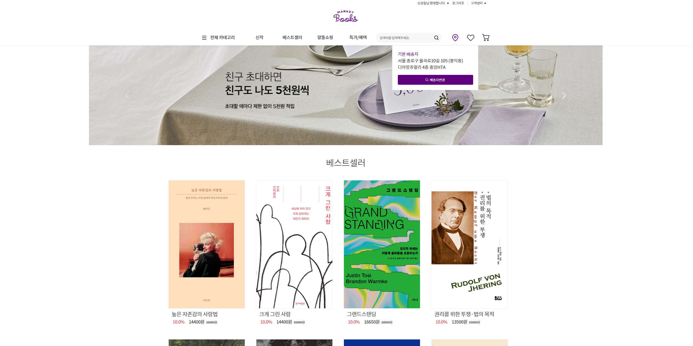
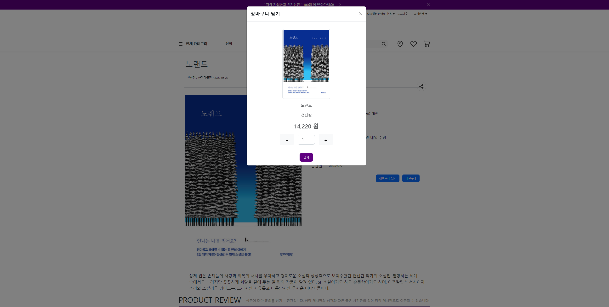
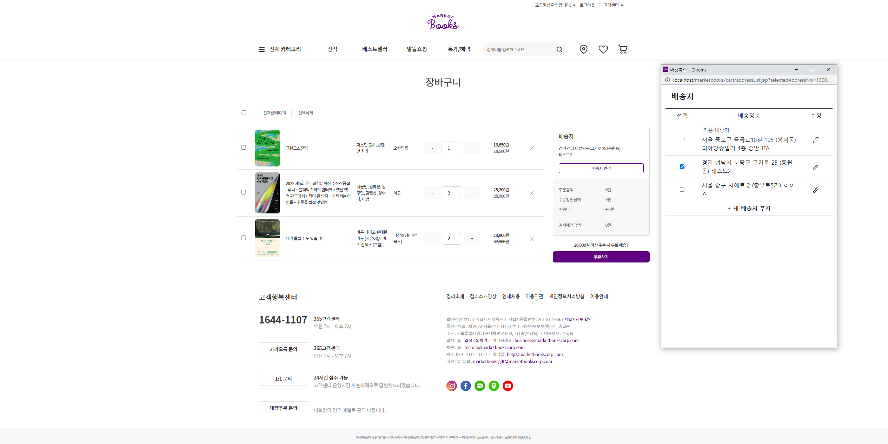
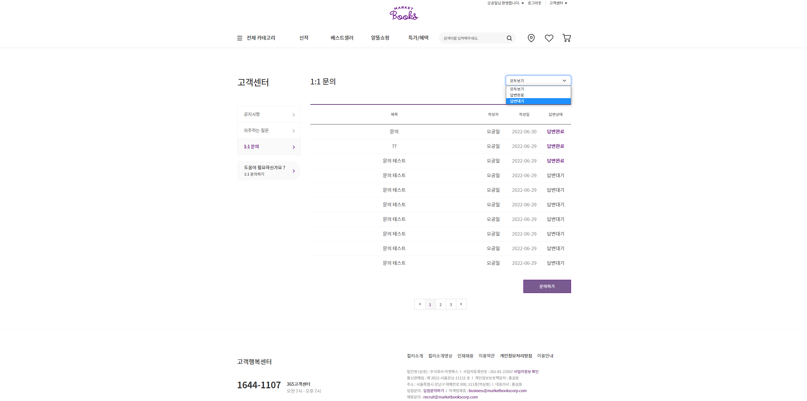
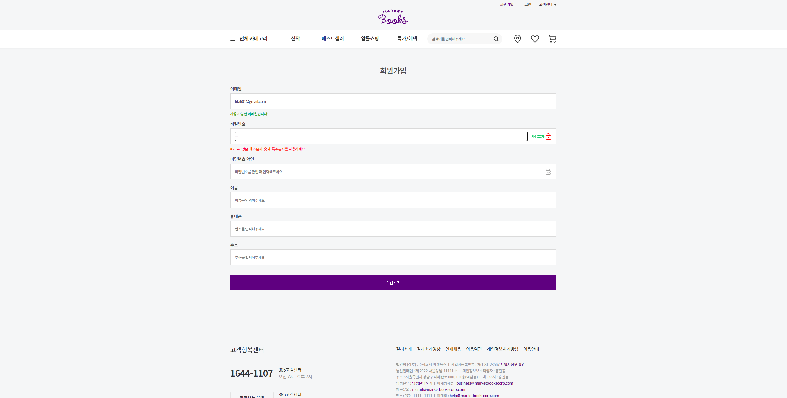
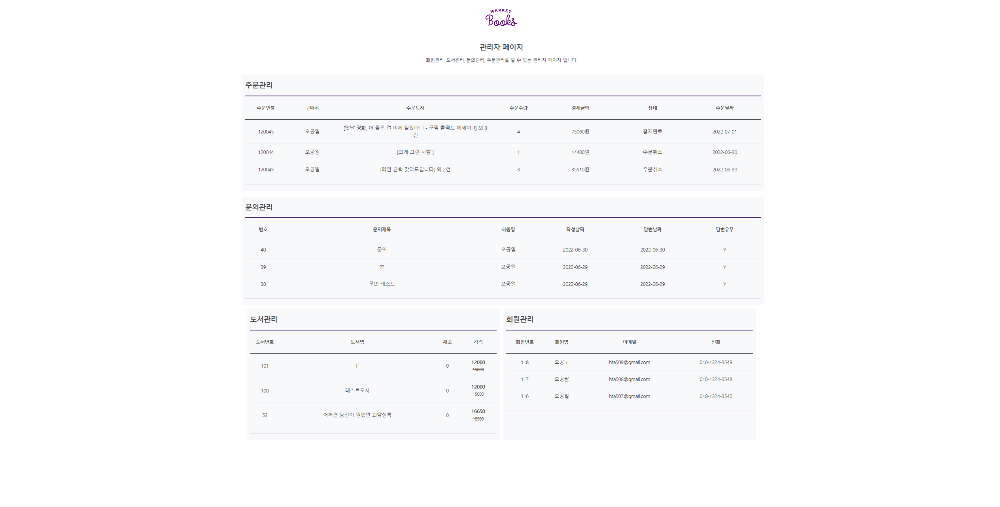
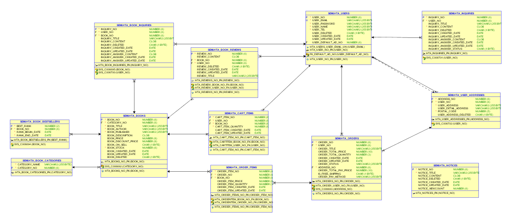

# Market Books
  
### 중앙HTA 세미프로젝트 1조  
  - 팀원 : 김준하, 조명환, 유도영(조장), 이제원, 정수민
  
  
  
## 🍇 프로젝트 소개 Description

### JSP model1 방식의 개발 실습을 위한 웹사이트 구현 프로젝트

- 프로젝트 주제  
  마켓컬리를 벤치마킹한 도서 쇼핑몰 구현
- 선정 이유  
  업무 흐름, 화면 구성이 명확한 식료품 쇼핑몰 '마켓컬리'를 벤치마킹하되, 도서정보에 대한 알라딘 openAPI를 활용해보고자 함
  

## 📅 개발 기간 Development Period
### 2022.06.13 ~ 2022.06.29

1. 레퍼런스 선정, 화면 및 업무 흐름 분석
2. 데이터베이스 설계
3. 관련 페이지 및 클래스 디렉토리 정리
4. 각자 담당한 화면 및 기능 구현
    
## 💻 개발 환경 Development Environment
- OS :  Window 10 64bit
- WAS : Apache Tomcat 10.0
- IDE : Eclipse 2021-12 (4.22.0)
- Language : Java 17.0.2
- DB : Oracle 21c EE (JDBC : ojdbc 11)
- Browser Support : Chrome
- HTML , CSS, Javascript with BootStrap 5.2.0
- Version Management : Git, Github  

## 📔 DB 설계 Database design

* DB 사용 시 유의사항  
  * id: semi
  *  pwd: zxcv1234
  * 테이블, 시퀀스 생성 및 필수 데이터 임포트:  
    /db/marketbooks_ddl.sql, essential_data_insert.sql 실행할 것

## 👥 담당 기능 Team Roles
- 김준하 : 메인페이지,  헤더, 푸터, 상품검색 및 상세조회
- 조명환 :  로그인, 회원가입, 마이페이지 개인정보 수정
- 유도영 : 장바구니 및 주문 관련 기능, 배송지 관리 기능
- 이제원 : 고객센터 공지사항, 1:1문의, 자주하는 질문
- 정수민 : 관리자페이지(회원, 게시글, 상품, 주문 관리)  

## 🔗 Used API
- kakao 우편번호 서비스
  https://postcode.map.daum.net/guide

- 알라딘 openAPI (기능에 적용하진 못했지만, 샘플데이터 추출을 위한 조회시에 활용함)
 https://blog.aladin.co.kr/openapi/category/29154402?communitytype=mypaper

